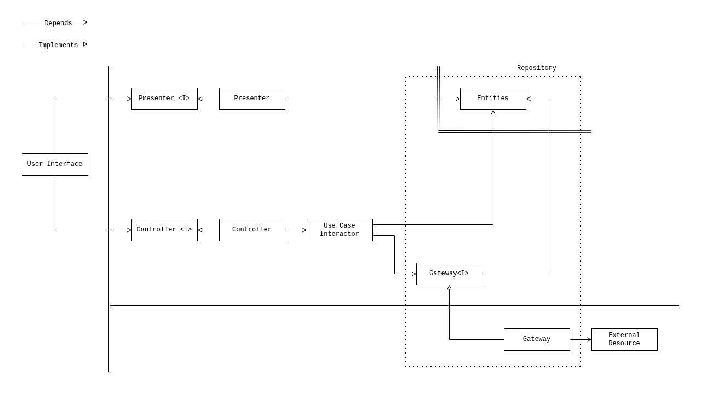

# Clean Reactive Architecture — Flutter Sample

A sample application that demonstrates
[Clean Reactive Architecture](https://github.com/clean-reactive/documentation/blob/main/docs/architecture.md)
implemented with Flutter and Riverpod.

The sample shows a concrete, working mapping of every architectural unit from
the diagram to idiomatic Flutter + Riverpod code. It covers entities, the
gateway interface, the repository, use cases, selectors, presenters,
controllers, drivers, and the user interface — with unit, integration and
widget tests across them.

> :bulb: **Architecture reference implementation.** `widgets/order` keeps its
> presenter, controller, and use case separate so the architecture is visible.
> Simpler widgets inline their units. This is a demonstration choice, not a
> rule that every widget must follow. See the
> [Development Methodology](https://github.com/clean-reactive/documentation/blob/main/docs/methodology.md).

## Getting started

The Flutter version is pinned in `.fvmrc`. With [fvm](https://fvm.app/):

```sh
fvm install
fvm flutter pub get
```

Run the application:

```sh
fvm flutter run
```

Run the tests and the analyzer:

```sh
fvm flutter test
fvm flutter analyze
```

Without fvm, drop the `fvm` prefix and use Flutter 3.47.1.

## Tech stack

- [Flutter](https://flutter.dev/) 3.47.1, Dart SDK `^3.13.1`
- [Riverpod](https://riverpod.dev/) (`flutter_riverpod` 3.x), including the
  experimental `Mutation` API for per-operation write state
- [fast_immutable_collections](https://pub.dev/packages/fast_immutable_collections)
  for id lists that must compare equal across reads
- [flutter_test](https://docs.flutter.dev/testing) + [mocktail](https://pub.dev/packages/mocktail)
- [flutter_lints](https://pub.dev/packages/flutter_lints)

## Architecture mapping

The table below shows how each unit from the Clean Reactive Architecture
diagram maps to this codebase.

| Architectural unit              | Flutter / Riverpod equivalent                  | Location                                                                     |
| ------------------------------- | ---------------------------------------------- | ---------------------------------------------------------------------------- |
| Enterprise business entity      | Plain Dart class                               | `repositories/order_entities.dart`                                           |
| Application business entity     | `Notifier` store, framework state              | `stores/orders_presentation.dart`, `toasts_presentation.dart`, …             |
| Gateway interface               | `abstract interface class`                     | `repositories/orders_gateway.dart`                                           |
| Repository (gateway + entities) | `AsyncNotifier`                                | `repositories/orders_repository.dart`                                        |
| Gateway implementation          | `OrdersGateway` implementation                 | `repositories/orders_service/`                                               |
| Use case interactor             | Callable class behind a `Provider`, or inline  | `use_cases/delete_order_use_case.dart`, `widgets/order_item.dart`            |
| Selector                        | `Provider` derived from the repository         | `selectors/orders_selector.dart`, `order_by_id_selector.dart`, …             |
| Presenter                       | `Provider` returning a view model, or inline   | `widgets/order/order_presenter.dart`, inline in simpler widgets              |
| Controller                      | `Provider` returning callbacks, or inline      | `widgets/order/order_controller.dart`, inline in simpler widgets             |
| ViewModel                       | Record `typedef`                               | `widgets/order/order_types.dart`                                             |
| User interface                  | `ConsumerWidget`, `_UserInterface` in `Order`  | `widgets/orders.dart`, `order/order.dart`, `order_item.dart`, …              |
| Driver                          | Widget that listens and renders nothing        | `drivers/toast_driver.dart`                                                  |
| External resource               | Whatever a service talks to                    | behind `RemoteOrdersService`                                                 |

## UML diagram representing application architecture



## Key design decisions

These decisions are specific to this sample, guided by its demonstration goals
and the capabilities of Flutter and the selected libraries. The architecture
defines responsibilities and boundaries without prescribing specific technical
solutions.

**Extracted units as Riverpod providers.** Extracted units in this sample are
implemented as providers composed by widgets. `Order` deliberately extracts its
presenter, controller, use case, and selectors so the full architecture is
visible. Simpler widgets inline units without independent policy or reuse.

**Widget build methods as composition roots.** A `ConsumerWidget`'s `build`
composes the units including User Interface unit (implemented with widgets) and
wires their dependencies through `WidgetRef`.

**Self-contained Flutter widgets.** Widgets own their view-facing behavior and
resolve their data within their composition boundary. Their constructor
parameters are limited to identity or configuration parameters, such as
`orderId` and `itemId`, rather than receiving entity data through parameters.
This is a deliberate demonstration choice to reduce structural coupling, not a
mandatory rule.

**Application business entity as a Riverpod `Notifier`.**
`OrdersPresentationStore` holds application-level state
(`ordersResource: local | remote`) that persists across use case calls and has
its own rules. It is managed by a dedicated `Notifier`, not by the repository.

**Framework state as an application business entity.** Flutter's
`ScaffoldMessenger` holds and renders the toasts, so it is the source of truth
and has no copy. `toastsPresentationStore` is a handle over the app's
`scaffoldMessengerKey` that needs no `BuildContext`, so no unit outside the user
interface ever takes one.

**Repository as a Riverpod `AsyncNotifier`.** `OrdersRepository` combines
gateway access and observable entity state. It consumes `OrdersGateway`,
declared separately in `orders_gateway.dart`, exposes read and write
operations, and manages the entities and optimistic updates. A write that fails
is recorded in `OrdersRepositoryFailedWrite`, with a token of its own so the
same failure twice is announced twice.

**Gateway selection at runtime.** `ordersServiceProvider` watches
`ordersPresentationStore` and returns either `InMemoryOrdersService` or
`RemoteOrdersService` according to `ordersResource`. The resource picker drops
the held orders and changes that state, and the repository reads the selected
resource.

**Drivers beside the user interface.** `OrdersToastDriver` renders nothing: it
listens to the repository and announces a failed read or write. Neither has
anything left alive to catch it, so both exist only as state, and reacting to
state is a driver's job. It sits beside the feature in `app.dart`, as one driver
among several.

## Folder structure

```console
lib
├── app.dart                                # application shell
├── main.dart                               # composition root (ProviderScope)
└── features
    └── orders
        ├── orders.dart                     # what the app is allowed to place
        ├── drivers                         # drivers other than the user interface
        │   └── toast_driver.dart
        ├── repositories                    # repository, gateway interface, gateway implementations
        │   ├── order_entities.dart         # enterprise business entities
        │   ├── orders_gateway.dart         # gateway interface
        │   ├── orders_repository.dart      # repository (gateway + entities)
        │   └── orders_service
        │       ├── in_memory_orders_service.dart
        │       ├── orders_service.dart     # picks the implementation at runtime
        │       └── remote_orders_service.dart
        ├── selectors                       # selectors
        │   ├── is_deleting_order_selector.dart
        │   ├── order_by_id_selector.dart
        │   └── orders_selector.dart
        ├── stores                          # application business entities
        │   ├── orders_presentation.dart
        │   └── toasts_presentation.dart    # handle to the app's toast state
        ├── use_cases                       # use case interactors
        │   └── delete_order_use_case.dart
        └── widgets                         # user interface, presenters, controllers
            ├── field.dart
            ├── order
            │   ├── order.dart              # user interface
            │   ├── order_controller.dart
            │   ├── order_presenter.dart
            │   └── order_types.dart        # view models
            ├── order_item.dart             # inline presenter, controller, use case
            ├── orders.dart                 # user interface + inline presenter
            ├── orders_resource_picker.dart # every unit inline
            ├── orders_statistics.dart      # every unit inline
            ├── pill.dart
            └── section_label.dart
```

## Tests

The test tree mirrors `lib`, and the levels follow the
[testing pyramid](https://github.com/clean-reactive/documentation/blob/main/docs/architecture.md):

- _Unit_ — one unit with everything below it stood in for, e.g.
  `repositories/orders_repository_test.dart` and
  `selectors/is_deleting_order_selector_test.dart`.
- _Integration_ — units composed with only the resource doubled, e.g. the
  `selectors/*_integration_test.dart` files reading through a real repository,
  `widgets/orders_integration_test.dart` driving the screen down to the
  gateway, and `drivers/toast_driver_test.dart` placing the driver beside the
  screen.

Run them all:

```sh
fvm flutter test
```

## Further reading

- [Clean Reactive Architecture](https://github.com/clean-reactive/documentation/blob/main/docs/architecture.md)
- [Development Methodology](https://github.com/clean-reactive/documentation/blob/main/docs/methodology.md)
